# Diagrame arhitectură – Aplicație bancară web

Acest document conține diagramele principale ale arhitecturii aplicației bancare. Diagramele sunt scrise în **Mermaid** și pot fi randate în GitHub, GitLab, VS Code cu extensie Mermaid sau în alte editoare compatibile.

## 1. Arhitectura generală a aplicației

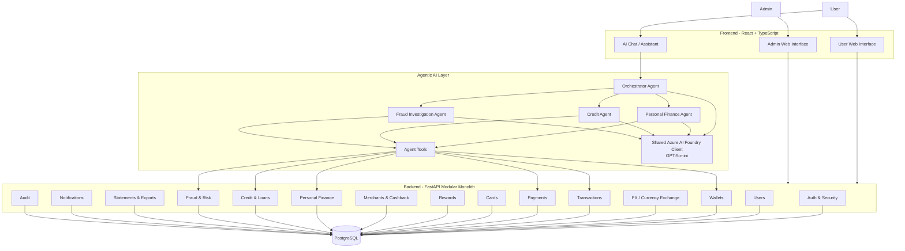

## 2. Regula principală pentru agenții AI

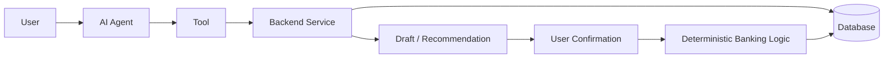

Regula de bază este `Agent -> Tool -> Backend Service -> Database`. Agenții nu accesează direct SQL-ul și nu execută direct tranzacții sensibile.

## 3. Domeniile principale

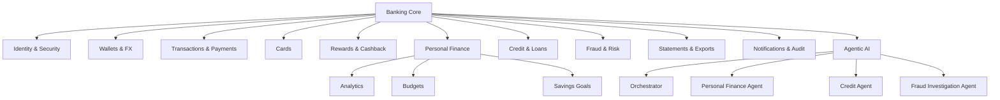

## 4. Schema centrală simplificată a bazei de date

```mermaid
erDiagram
    USER ||--o{ WALLET : owns
    USER ||--o{ CARD : owns
    USER ||--o{ TRANSACTION : initiates
    USER ||--o{ USER_SESSION : has
    USER ||--o{ USER_DEVICE : uses
    USER ||--o| BUSINESS_PROFILE : may_have

    WALLET ||--o{ WALLET_LEDGER_ENTRY : contains
    TRANSACTION ||--o{ WALLET_LEDGER_ENTRY : produces
    WALLET ||--o{ TRANSACTION : source_or_destination

    TRANSACTION }o--o| MERCHANT : targets
    MERCHANT ||--o{ CASHBACK_OFFER : provides

    USER ||--o| REWARD_ACCOUNT : has
    REWARD_ACCOUNT ||--o{ REWARD_TRANSACTION : contains
    TRANSACTION ||--o{ REWARD_TRANSACTION : generates

    TRANSACTION ||--o| FRAUD_CASE : may_create
    FRAUD_CASE ||--o{ FRAUD_FLAG : contains

    USER ||--o{ BENEFICIARY : saves
    USER ||--o{ SCHEDULED_PAYMENT : creates
    USER ||--o{ PAYMENT_REQUEST : creates

    USER ||--o{ TRANSACTION_FOLDER : owns
    TRANSACTION_FOLDER ||--o{ TRANSACTION_FOLDER_ITEM : contains
    TRANSACTION ||--o{ TRANSACTION_FOLDER_ITEM : grouped_in

    USER ||--o{ BILL_SPLIT : creates
    BILL_SPLIT ||--o{ BILL_SPLIT_PARTICIPANT : contains

    USER ||--o{ BUDGET : defines
    USER ||--o{ SAVINGS_GOAL : defines

    USER ||--o| CREDIT_PROFILE : has
    CREDIT_PROFILE ||--o{ CREDIT_SCORE_HISTORY : history
    USER ||--o{ CREDIT_APPLICATION : submits
    USER ||--o{ LOAN : has

    LOAN ||--o{ LOAN_INSTALLMENT : contains
    LOAN ||--o{ LOAN_PAYMENT : receives

    USER ||--o{ NOTIFICATION : receives
    USER ||--o{ EXPORT : creates
    USER ||--o{ BIOMETRIC_VERIFICATION : performs
```

## 5. Wallet-uri multi-currency

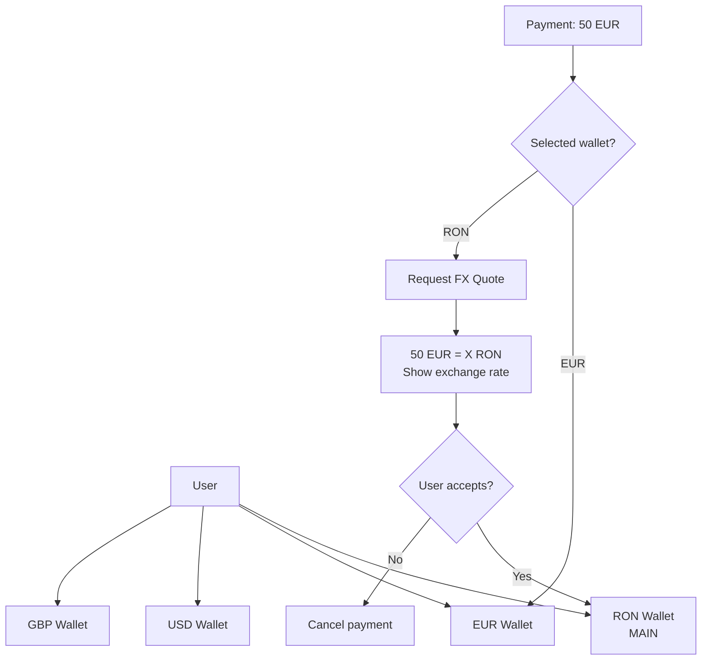

## 6. Lifecycle-ul unei tranzacții

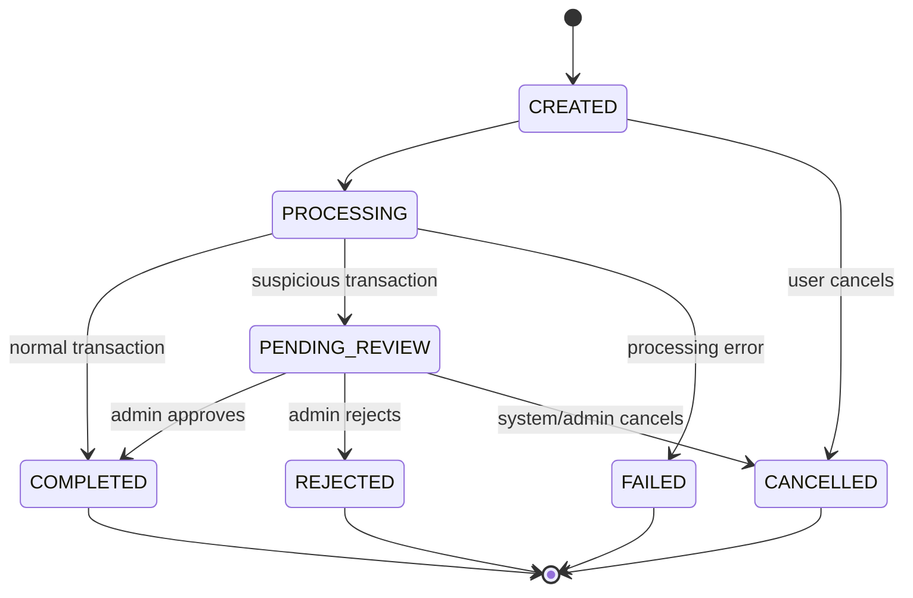

## 7. Flux antifraudă

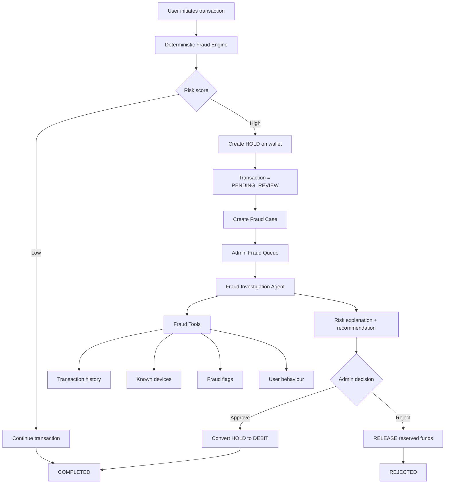

## 8. Card payment architecture

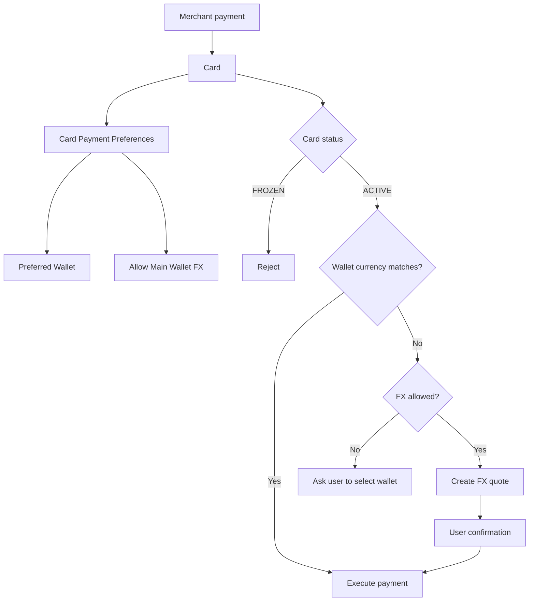

## 9. Transfer după numărul de telefon

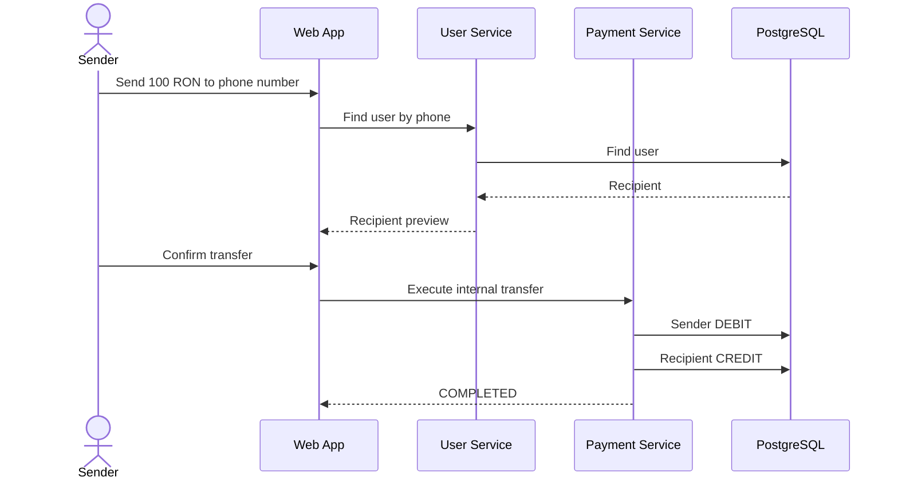

## 10. QR Payments

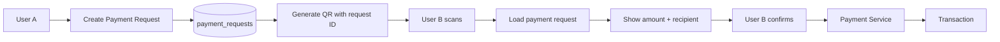

## 11. Scheduled și recurring payments

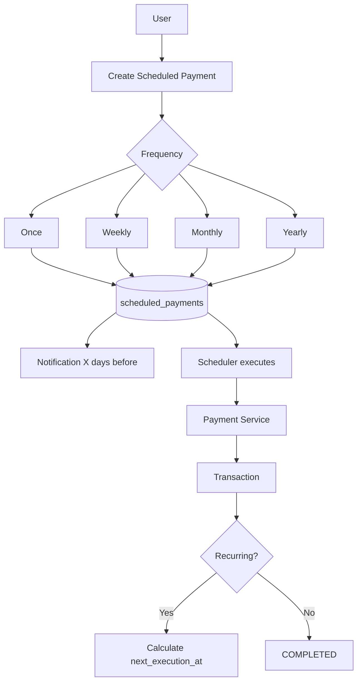

## 12. Rewards și merchant cashback

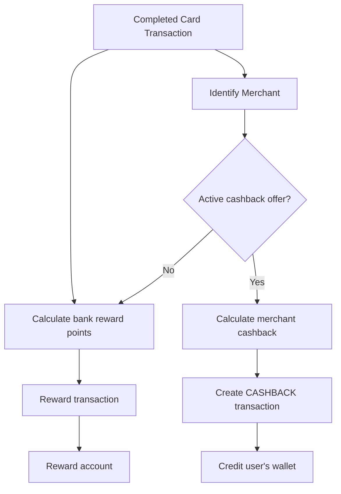

## 13. Personal Finance Agent

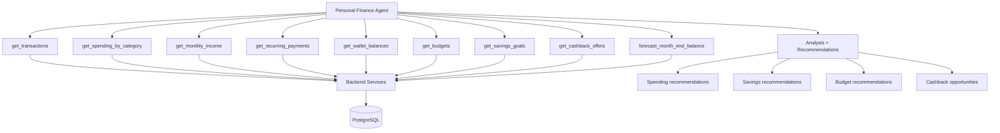

## 14. Credit architecture

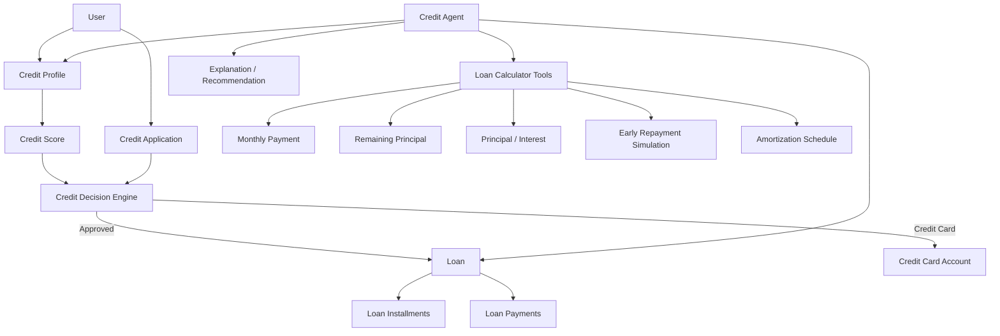

## 15. Plată anticipată credit

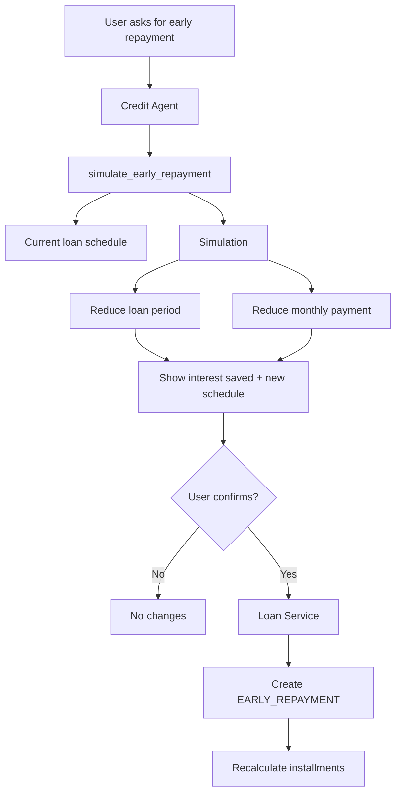

## 16. Orchestrator Agent

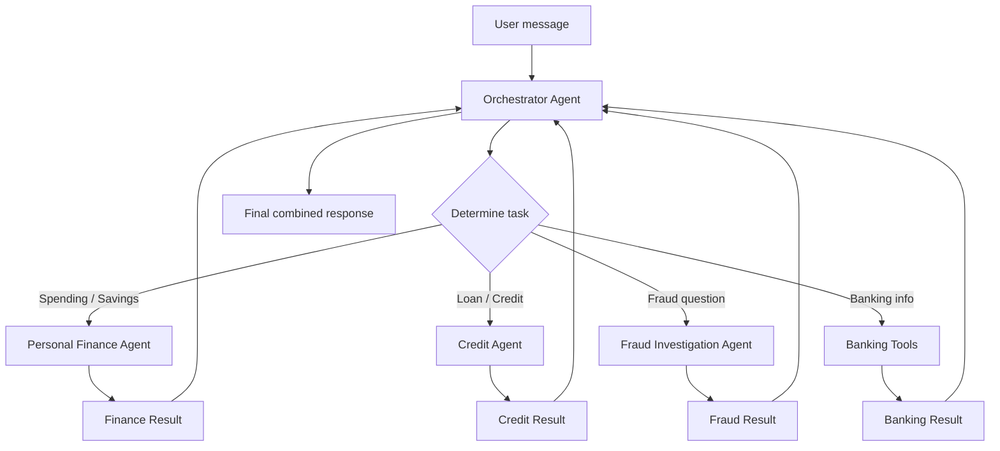

## 17. Azure AI Foundry

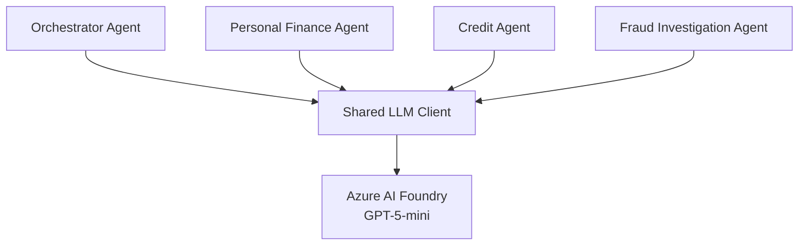

Singurul LLM disponibil este GPT-5-mini din Azure AI Foundry. Configurația trebuie ținută în environment variables, iar aplicația trebuie să poată porni și fără credentialele Azure în fazele fără AI.

## 18. Statements și business exports

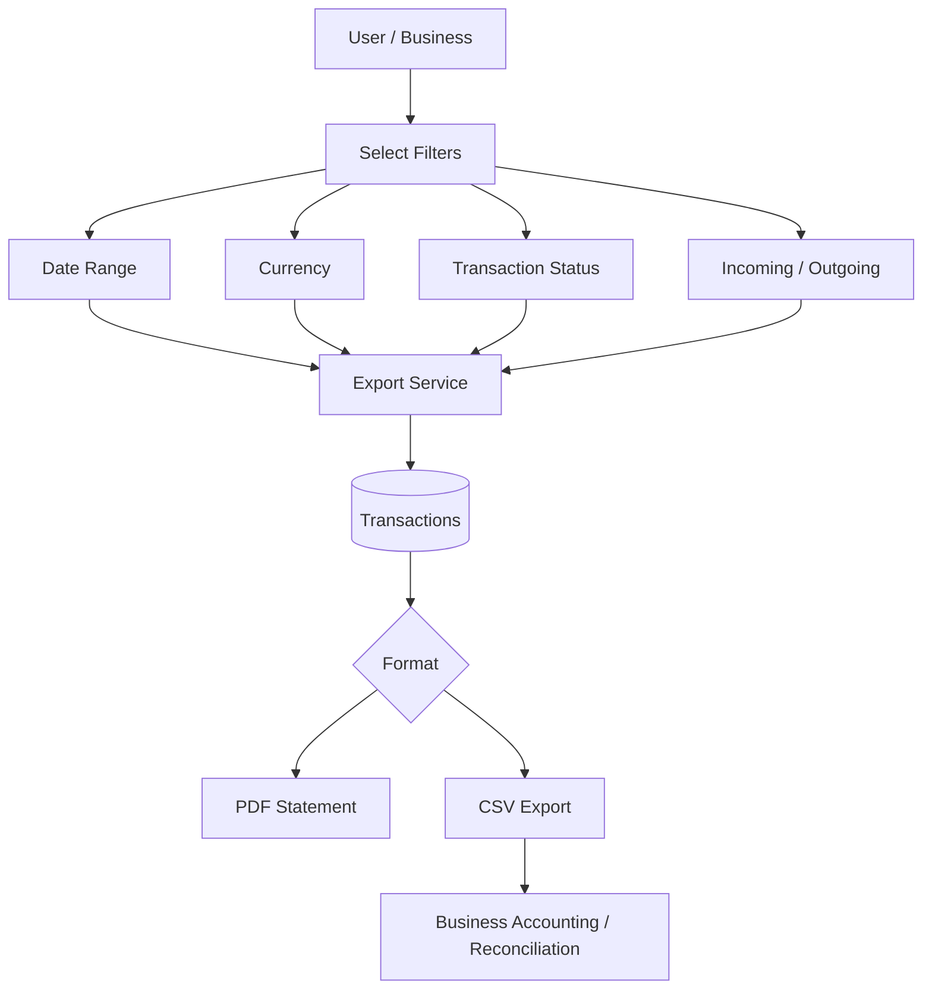

## 19. Split the Bill

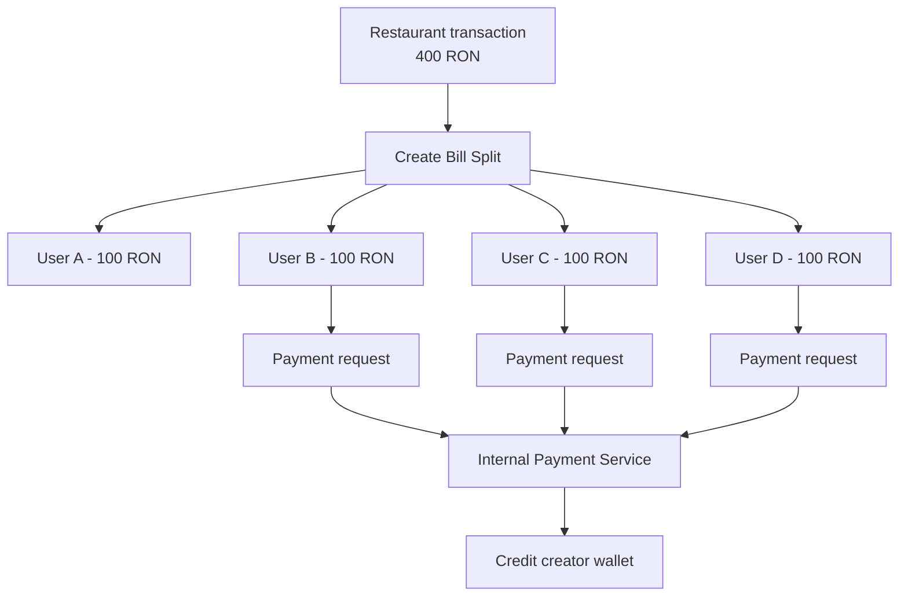

## 20. Transaction folders

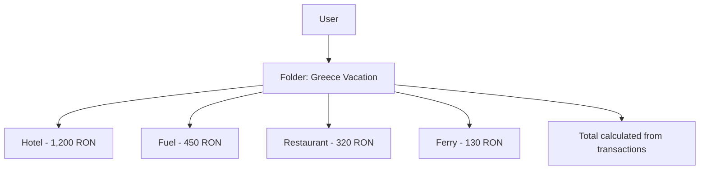

## 21. Backend modular monolith

```mermaid
flowchart TB
    API[FastAPI /api/v1]
    API --> AUTH[auth]
    API --> USERS[users]
    API --> WALLETS[wallets]
    API --> TX[transactions]
    API --> FX[fx]
    API --> PAY[payments]
    API --> CARDS[cards]
    API --> REWARDS[rewards]
    API --> MERCHANTS[merchants]
    API --> PF[personal_finance]
    API --> CREDIT[credit]
    API --> FRAUD[fraud]
    API --> NOTIF[notifications]
    API --> EXPORTS[exports]

    AUTH --> SERVICES[Service Layer]
    USERS --> SERVICES
    WALLETS --> SERVICES
    TX --> SERVICES
    FX --> SERVICES
    PAY --> SERVICES
    CARDS --> SERVICES
    REWARDS --> SERVICES
    MERCHANTS --> SERVICES
    PF --> SERVICES
    CREDIT --> SERVICES
    FRAUD --> SERVICES
    NOTIF --> SERVICES
    EXPORTS --> SERVICES

    SERVICES --> ORM[SQLAlchemy]
    ORM --> DB[(PostgreSQL)]
    MIG[Alembic Migrations] --> DB
```

## 22. Structura repository-ului

```text
banking-app/
├── frontend/
│   ├── src/
│   │   ├── app/
│   │   ├── components/
│   │   ├── pages/
│   │   ├── features/
│   │   ├── api/
│   │   ├── hooks/
│   │   └── types/
│   └── package.json
├── backend/
│   ├── app/
│   │   ├── main.py
│   │   ├── core/
│   │   │   ├── config.py
│   │   │   ├── database.py
│   │   │   └── security.py
│   │   ├── modules/
│   │   │   ├── auth/
│   │   │   ├── users/
│   │   │   ├── wallets/
│   │   │   ├── transactions/
│   │   │   ├── fx/
│   │   │   ├── payments/
│   │   │   ├── cards/
│   │   │   ├── rewards/
│   │   │   ├── merchants/
│   │   │   ├── personal_finance/
│   │   │   ├── credit/
│   │   │   ├── fraud/
│   │   │   ├── notifications/
│   │   │   └── exports/
│   │   └── ai/
│   │       ├── client/
│   │       ├── orchestrator/
│   │       ├── personal_finance/
│   │       ├── credit/
│   │       ├── fraud/
│   │       └── tools/
│   ├── migrations/
│   └── tests/
├── docs/
│   ├── architecture.md
│   └── architecture_diagrams.md
├── docker-compose.yml
├── .env.example
└── README.md
```

## 23. Împărțirea pe cei 4 developeri

```mermaid
flowchart TB
    FOUNDATION[Shared Foundation\nAuth + Users + DB + Wallet + Transaction]
    FOUNDATION --> D1[Developer 1\nCore Banking]
    FOUNDATION --> D2[Developer 2\nPayments]
    FOUNDATION --> D3[Developer 3\nCards & Credit]
    FOUNDATION --> D4[Developer 4\nIntelligence]

    D1 --> F1[Wallets]
    D1 --> F2[FX]
    D1 --> F3[Ledger]
    D1 --> F4[Statements]

    D2 --> P1[Transfers]
    D2 --> P2[QR]
    D2 --> P3[Recurring Payments]
    D2 --> P4[Split Bill]
    D2 --> P5[Business Export]

    D3 --> C1[Cards]
    D3 --> C2[Freeze / One-time]
    D3 --> C3[Credit Score]
    D3 --> C4[Loans]
    D3 --> C5[Loan Calculator]

    D4 --> I1[Analytics]
    D4 --> I2[Rewards / Cashback]
    D4 --> I3[Budgets / Savings]
    D4 --> I4[Fraud]
    D4 --> I5[AI Agents]
```

## 24. Ordinea recomandată de dezvoltare

```mermaid
flowchart LR
    P1[Phase 1\nFoundation] --> P2[Phase 2\nBanking Engine]
    P2 --> P3[Phase 3\nAdvanced Banking]
    P3 --> P4[Phase 4\nRisk & Intelligence]
    P4 --> P5[Phase 5\nAgentic AI]
```

### Phase 1
- Auth
- Users
- PostgreSQL
- Wallet
- Transaction
- Ledger

### Phase 2
- FX
- Transfers
- Cards

### Phase 3
- QR
- Split Bill
- Rewards
- Cashback
- Scheduled/Recurring Payments
- Credit
- PDF/CSV Exports

### Phase 4
- Fraud Engine
- Analytics
- Budgets
- Savings Goals

### Phase 5
- Orchestrator Agent
- Personal Finance Agent
- Credit Agent
- Fraud Investigation Agent

## 25. MVP

```mermaid
flowchart LR
    LOGIN[Login] --> DASH[Dashboard]
    DASH --> WALLET[Wallets]
    WALLET --> TX[Transactions]
    TX --> TRANSFER[Transfer]
    WALLET --> FX[Exchange]
    DASH --> CARDS[Cards]
    CARDS --> FREEZE[Freeze / Unfreeze]
    DASH --> ANALYTICS[Basic Analytics]
```

## Principii arhitecturale

1. Aplicația este un **modular monolith**, nu microservicii.
2. `User`, `Wallet`, `Transaction` și `WalletLedgerEntry` formează nucleul.
3. Mișcările financiare importante sunt reprezentate prin tranzacții și ledger entries.
4. Agenții AI nu modifică direct baza de date.
5. Agenții AI folosesc tools care apelează serviciile backend.
6. Operațiile financiare sensibile necesită confirmarea utilizatorului.
7. Fraud Engine-ul este determinist; Fraud Investigation Agent explică și asistă adminul.
8. Calculele de credit sunt deterministe și realizate de Loan Calculator Tools.
9. GPT-5-mini din Azure AI Foundry este singurul LLM disponibil.
10. Aplicația trebuie să poată rula local fără Azure AI configurat.
11. Cardurile, biometria, comercianții și integrarea bancară sunt mock/sandbox pentru proiect.
12. PostgreSQL este baza de date centrală.
13. SQLAlchemy este ORM-ul backend.
14. Alembic gestionează migrations.
15. Frontend-ul comunică cu backend-ul prin REST API sub `/api/v1`.
